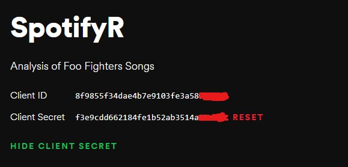

For quite some time I've been trying new things in the Data Science realm of things and I was thrilled to find out about this quite underrated and unknown package called SpotifyR, which pulls data from - you guessed it - Spotify. It lets you perform analysis on songs, tracks and artists' data on R Programming Language. Although R undeservingly gets a bad reputation especially when compared to Python, I find it fun to use and fairly quick to process data when we're not working with huge dataframes of thousands of data points.
Let's dive into SpotifyR and find you what exactly it can and can't do. As beautifully described by its developer Charlie Thompson:
"SpotifyR is an R wrapper for pulling track audio features and other information from Spotify’s Web API in bulk. By automatically batching API requests, it allows you to enter an artist’s name and retrieve their entire discography in seconds, along with Spotify’s audio features and track/album popularity metrics. You can also pull song and playlist information for a given Spotify User (including yourself!)."  
**TL/DR** We can pull Spotify data from:  
- Users
- Playlists
- Artists
- Albums
- Tracks, etc.

# Setup
The first step to obtaining data from Spotify, even before setting up shop in R, is to create a Developer account with Spotify. Luckily, it's pretty straightforward to do:
1. Login with your Spotify account here: 
https://developer.spotify.com/dashboard/login
Obs: create one if you don't have it.  
2. On your Dashboard, create a project with something along the lines of:  


As it's not a commercial project - not yet, anyway, you can skip the part that concerns Commercial integration.
Entering your project Dashboard you should see the Client ID and Client Secret. We're gonna use those.


3. Copy both and paste it right here and we'll set them up as system environment variables here in R for easier access later.
```{r}
id <- 'your client ID'
secret <- 'your client secret'
Sys.setenv(SPOTIFY_CLIENT_ID = id)
Sys.setenv(SPOTIFY_CLIENT_SECRET = secret)
```
As for the Spotify side, we're good to go!

For more information on the Spotify API, some of the metrics, functions and data you can use from Spotify:
https://developer.spotify.com/documentation/web-api/reference/tracks/get-audio-features/
Now on to the R side of things:

## Required packages

Let's first install SpotifyR directly from GitHub with the following command:
```{r}
#devtools::install_github('JosiahParry/genius')
#devtools::install_github('charlie86/spotifyr')
```
Some people have encountered some problems when installing this package since it was removed from CRAN, which as you may know, it's the main resource for R packages. Maybe you'll have to install first JosiahParry's "genius" package, which is a dependency for SpotifyR. I left the instruction to install genius, let me know if you run into some problems when doing it.

```{r, echo=FALSE}
#Let's load the packages we're gonna need
library(spotifyr)
library(plyr)
library(tidyverse)
library(ggthemes)
library(ggridges)
library(knitr)
library(kableExtra)
library(lubridate)
```
```{r}
access_token <- get_spotify_authorization_code(scope = c('user-top-read','playlist-read-private','user-read-recently-played'))
```
We also execute the code to obtain the access token with the function of SpotifyR designed to do so, based on our Client ID and Client Secret set a minute ago. We need to pass out exactly the scope you want for the functions you are going to use. Refer to the Spotify Devs page for more on that. 

# Analysis
## Your recently played songs
Self-explanatory, it gets up to the minute the last songs you played on Spotify.
```{r}
get_my_recently_played(limit = 5, authorization = access_token) %>% 
    mutate(artist.name = map_chr(track.artists, function(x) x$name[1]),
           played_at = as_datetime(played_at)) %>% 
    select(track.name, artist.name, track.album.name, played_at) 
```

## Your favorite tracks or artists
Function get_my_top_artists_or_tracks is one the coolest of this package. It allows us to see the user's favorites songs or artists for the short, medium or long term. Other than that, you can change parameter type to "tracks" or "artists" and you obtain the information you need.
```{r}
get_my_top_artists_or_tracks(type = 'tracks', time_range = 'medium_term', limit = 10, authorization = access_token) %>% 
    mutate(artist.name = map_chr(artists, function(x) x$name[1])) %>% 
    select(name, artist.name, album.name)
```

My top artists in the medium term. Looks pretty good to me, they are 5 of my favorite bands.
```{r}
get_my_top_artists_or_tracks(type = 'artists', time_range = 'medium_term', limit = 5,authorization = access_token) %>% 
    select(name, genres) %>% 
    rowwise %>% 
    mutate(genres = paste(genres, collapse = ', ')) %>% 
    ungroup 
```

### Playlists
You can also pull data from your (or others') playlists. Here I use data from my "Your Top Songs 2019" playlist which is the recap for the year of 2019 of your 100 most listened songs.
Put your Spotify ID in the "my_id" variable and try it on one of your playlists.
```{r}
my_id <- '12166726349'
my_playlists <- get_user_playlists(my_id,authorization = access_token)

my_playlists2 <- my_playlists %>%
  filter(name %in% c('Your Top Songs 2019'))
tracks <- get_playlist_tracks(my_playlists2$id)
features <- get_track_audio_features(tracks$track.id)
tracks2 <- tracks %>%
  left_join(features, by=c('track.id' = 'id'))
tolerance = 0.05
tracks2 %>%
  filter((energy>mean(energy)-tolerance)&(energy<mean(energy)+tolerance)&
           (valence>mean(valence)-tolerance)&(valence<mean(valence)+tolerance)&
         (track.popularity/100>mean(track.popularity/100)-tolerance)&(track.popularity/100<mean(track.popularity/100)+tolerance)) %>%
  mutate(artist.name = map_chr(track.album.artists, function(x) x$name[1])) %>% 
  select(artist.name,track.name,energy,valence,track.popularity) %>%
  bind_rows(data.frame(artist.name = '---average---',track.name = '---average---',energy=mean(tracks2$energy),valence=mean(tracks2$valence),track.popularity=mean(tracks2$track.popularity))) %>%
  arrange(energy) 
```
I also calculated the average energy, valence and popularity for all songs in my playlist and lastly, with a tolerance of 5%, I found the songs that are most representative of it. **Those are the 3 songs that most resemble my average taste in music.**
As you can see, one can extract many insights with just a quick look at the data, for instance: I like songs with high energy and middle-of-the-pack in terms of valence and popularity. :)

## Deeper analysis of song features
Here's the function to import song data from an artist. Simple as that, we get data for 99 Foo Fighters songs:
```{r, warning=FALSE}
foo <- get_artist_audio_features('foo fighters')
nrow(foo)
```
Obs: By default, this function only obtains "official" albums, not B-sides, singles, greatest hits collections and bonus stuff.

As you can see, lots of information, much more than we're gonna use this time. Next, some data cleanup, let's select only a few of the variables and remove the Live album, which might interfere on our analyses.
```{r}
foo <- foo %>% 
  select(track_name, album_name, valence, danceability,energy,loudness,speechiness,liveness,tempo,album_release_year,track_number) %>% 
  arrange(album_release_year) %>%
  unite(album,album_name,album_release_year,sep=' - ',remove=FALSE)
foo$album_name <- as.factor(foo$album_name)
foo$album_release_year <- as.factor(foo$album_release_year)
```
Quick and simple, we obtained and cleaned up the data. Thanks to Spotify and SpotifyR we can figure some stuff out about Dave Grohl's work.
As described here, Spotify has a pretty comprehensive database of song information. Each song has a few metrics that represent numerically musical features such as loudness, tempo, key, etc. A full list can be found on the above mentioned Spotify Page for developers, but for shortness, we'll focus on only one of them, of that's pretty characteristic of Foo Fighters throughout their career: **Energy**.  
On the context of Spotify, Energy is described as:
A measure from 0.0 to 1.0 and represents a perceptual measure of intensity and activity. Typically, energetic tracks feel fast, loud, and noisy. For example, death metal has high energy, while a Bach prelude scores low on the scale. Perceptual features contributing to this attribute include dynamic range, perceived loudness, timbre, onset rate, and general entropy. 

Fast, loud and noisy, they said? Sounds like Foo Fighters to me :)
One cool way to visualize graphically one metric is through a Ridge Plot. It shows a distribution of said metric within each album. Let's do that for the metric of Energy.  
## Energy by album
```{r, warning=FALSE}
ggplot(foo, aes(x = energy,y=fct_rev(album_release_year))) + 
  geom_density_ridges(scale = 2, size = 0.1, rel_min_height = 0.03,quantile_lines=TRUE,quantiles=2) +
  theme_ridges()+
  scale_y_discrete(labels=c('Concrete and Gold - 2017','Sonic Highways - 2014','Wasting Light - 2011','Echoes, Silence, Patience & Grace - 2007','In Your Honor - 2005','There Is Nothing Left To Lose - 1999','The Colour And The Shape - 1997','Foo Fighters - 1995'))+ 
  scale_x_continuous( expand = c(0, 0)) +
  labs(title= "Foo Fighters energy by album",subtitle = "Based on data from Spotify", y="Album", x = "Energy")
```
And wouldn't you know, most Foo Fighters songs rate pretty high on the energy spectrum. No surprises here!

A table representation of the same data:
```{r}
foo %>% 
  group_by(album) %>% 
  summarise(avg = mean(energy),max = max(energy),min = min(energy)) %>% 
  arrange(-avg) %>% kable() %>% 
  kable_styling("striped", full_width = F, position = "left")%>% 
  row_spec(row = 1, color = "black",bold = TRUE)
```

## Songs with the most Energy
Easily enough, we can also show a table with the 10 songs with the most energy:
```{r}
foo %>% 
  arrange(-energy) %>% 
  select(track_name, album, energy) %>% 
  head(10) %>% 
  kable() %>% 
  kable_styling("striped", full_width = F, position = "left") %>% 
  row_spec(row = c(1), color = "black",bold = TRUE)
```

## Analysis of a specific album
The Colour and The Shape, Foo Fighters' second album from 1997 is their most critically acclaimed and well regarded as their masterpiece with easily recognized songs such as: Everlong, My Hero, Monkey Wrench.
Here's how you can see information for each song individually. Through conditional formatting, we're highlighting the songs with the most energy and other metrics as well.
```{r}
foo %>% 
  arrange(track_number) %>% 
  filter(album_name == 'The Colour And The Shape') %>% 
  select(track_name,track_number,energy,valence,tempo) %>% 
  mutate(
    energy = cell_spec(energy, "html", bold = ifelse(energy == max(energy), TRUE, FALSE)),
    valence = cell_spec(valence, "html", bold = ifelse(valence == max(valence), TRUE, FALSE))
  ) %>%
  kable(format = 'html',escape=F) %>% 
  kable_styling("striped", full_width = F, position = "left",bootstrap_options = c("striped", "hover", "condensed", "responsive"))
```

# Conclusions:
SpotifyR makes it super easy to investigate Spotify data for playlists, artists, songs and users and can be used in a variety of ways, be it for classification or recommendation systems, or just for fun if you are a data enthusiast like me.
Following this article, I'll look at some of Foo Fighters albums in more depth including lyrics analysis.